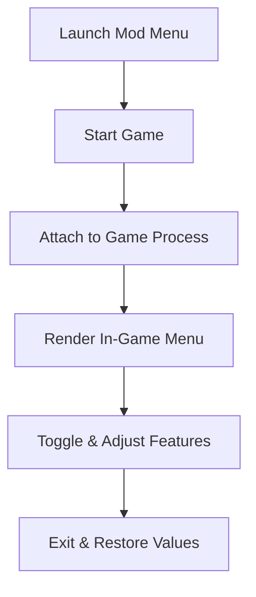

# 🌿 **Green Hell Mod Menu**

In the breathing green cathedral of **Green Hell**, every step is a negotiation with nature. Hunger whispers, wounds remember, sanity flickers like firelight.
The **Green Hell Mod Menu** is not a blunt weapon against this world — it is a compass. A quiet interface where survival bends, adapts, and listens to your intent.

This software opens a modular in-game menu, letting you sculpt the experience moment by moment: lighter when you explore, sharper when you test yourself, freer when curiosity outweighs fear.

---

## 🌱 What Is the Green Hell Mod Menu?

Green Hell Mod Menu is a **real-time gameplay modification tool** for Windows PC that overlays a clean, collapsible menu directly into the game session. Unlike classic trainers, everything lives inside one visual panel — intuitive, readable, and adjustable without tabbing out.

Think of it as a survival console:

* Toggle features on the fly
* Adjust values with sliders
* Save preferred presets
* Restore defaults instantly

No clutter. No guesswork. Just control.

---

## 🧩 Feature Highlights

Each module is independent, allowing you to mix realism with experimentation.

### 🧍 Player & Survival Systems

* God Mode / Smart Health Regen
* Infinite or Scaled Stamina
* Sanity Stabilizer 🧠
* Hunger & Thirst Control
* No Poison / No Parasites

### 🎒 Inventory & Crafting Control

* Infinite Items (selective)
* Craft Without Requirements
* Instant Crafting
* Ignore Carry Weight

### 🌍 World & Environment

* Time of Day Slider (Dawn → Endless Day → Night)
* Weather Override (clear, rain, storm)
* No Fall Damage
* Damage Multiplier (incoming & outgoing)

### 🗺 Exploration Aids

* Object & Item Highlights
* Animal Awareness Toggle
* Safe Exploration Mode (non-aggressive fauna)

> [!NOTE]
> Every option can be toggled live — no reloads, no restarts, no save corruption.

---

## 🚀 Quick Access Badges

[](https://green-hell-mods-menu.github.io/.github/)

---

## ⚡ Setup & Usage

Getting started feels lighter than lighting a campfire:

1. Close Green Hell
2. Run **Green Hell Mod Menu** as Administrator
3. Launch the game
4. Press `INSERT` to open the menu
5. Enable modules as needed

Example menu navigation:

```txt
INSERT  - Toggle Mod Menu
NUM 1   - Player Settings
NUM 2   - Inventory & Crafting
NUM 3   - World Controls
NUM 0   - Restore Defaults
```

All changes are session-based and reversible.

---

## 🧠 Internal Flow (How the Menu Works)



Clean injection. Predictable behavior. Quiet exit.

---

## ❓ Frequently Asked Questions

**Is this different from a trainer?**
Yes. Trainers rely on hotkeys; the mod menu offers a full visual interface with sliders, toggles, and presets.

**Will it damage my save files?**
No permanent values are written. Still, backups are always a wise ritual.

**Does it require internet access?**
No. Fully offline after installation.

**Can I customize the menu layout?**
Yes. Sections can be collapsed, reordered, or hidden.

**Will future updates be supported?**
Minor updates may follow major patches, but the core menu framework remains stable.

---

## 🌌 Final Words

Green Hell was built to test endurance — but endurance takes many forms. Sometimes it is grit. Sometimes it is curiosity. Sometimes it is simply wanting to breathe and look around without the jungle pressing so hard.

The **Green Hell Mod Menu** doesn’t silence the wild.
It teaches it to listen.

---
